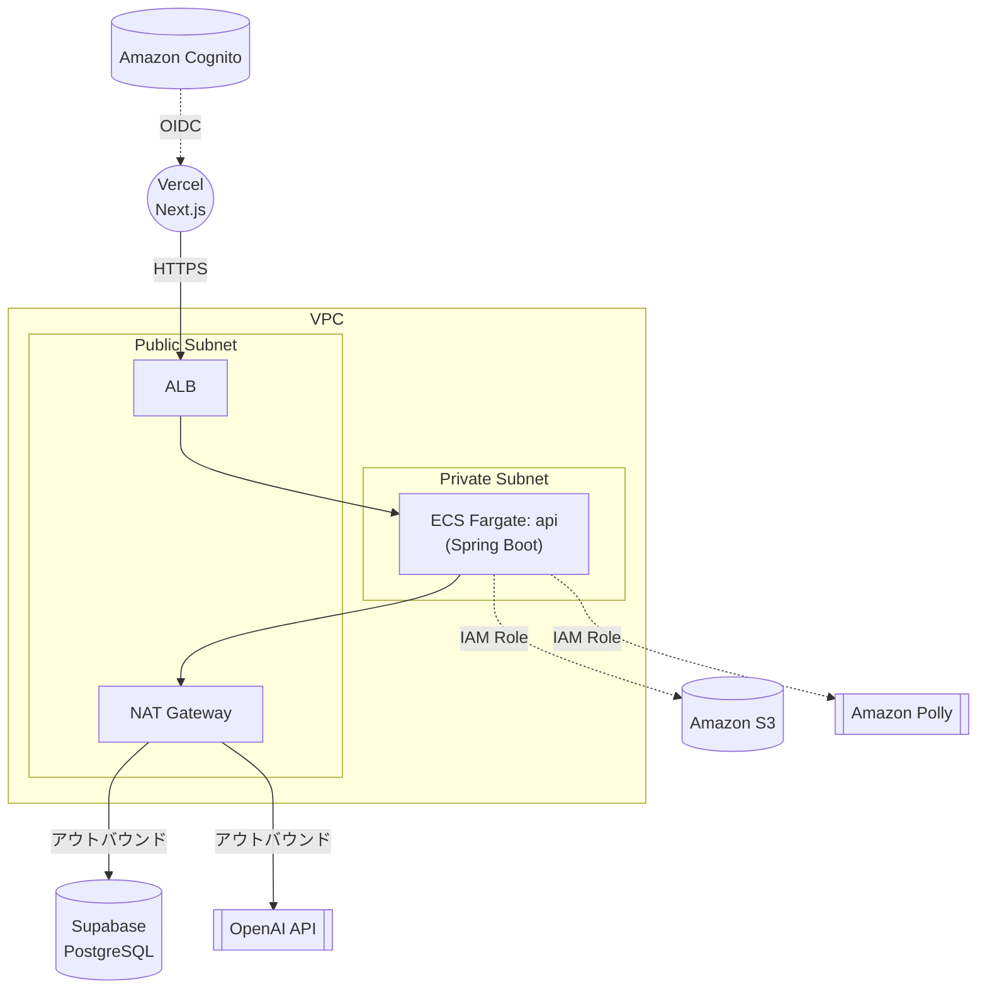

# IELTS Creator

AIがIELTS Reading/Listeningの練習問題をその場で生成し、ユーザーはすぐに回答して自動採点結果を受け取れます。受験履歴やスコア推移も確認できます。

本リポジトリは**プロジェクト紹介用（ランディング）リポジトリ**です。全体の要件定義・アーキテクチャと、各実装リポジトリへの導線をまとめています。アプリケーションコードは含みません。

## リポジトリ一覧

| リポジトリ | 内容 |
| --- | --- |
| [ielts-creater-frontend](https://github.com/h-fujiwara-dev/ielts-creater-frontend) | Next.js（App Router）+ TypeScript。画面仕様は `docs/画面一覧.md` `docs/画面設計書/` に記載 |
| [ielts-creater-backend](https://github.com/h-fujiwara-dev/ielts-creater-backend) | Spring Boot 3 + Java 21。API・DB・機能仕様は `docs/` に記載。ローカルPostgresは `docker-compose.yml` で起動 |
| [ielts-creater-infra](https://github.com/h-fujiwara-dev/ielts-creater-infra) | AWSインフラ（VPC, ECS, S3, Cognito等）のTerraformコード（DBはSupabase、フロントエンドはVercelでホスティング） |

## 技術スタック

- **フロントエンド**: Next.js（App Router）+ TypeScript、Vercelでホスティング
- **バックエンド**: Spring Boot 3 + Java 21、ECS Fargate上でホスティング
- **データベース**: PostgreSQL（Supabase）、Flywayでマイグレーション管理
- **認証**: Amazon Cognito（User Pool）+ フロントはNextAuth.js、バックエンドはSpring Security Resource Server
- **AI生成**: OpenAI API（Structured Outputsで問題文・設問を生成）
- **音声合成**: Amazon Polly（Listening音声、S3に保存）
- **IaC**: Terraform（AWS側リソースのみ。Vercel/Supabaseは各サービスで管理）
- **CI/CD**: GitHub Actions（backend/infra）+ Vercel自動デプロイ（frontend）

## インフラ構成

フロントエンドはVercel、データベースはSupabaseでホスティングし、バックエンド（ECS Fargate）はPrivate SubnetからNAT Gateway経由でSupabase等の外部サービスに接続する構成（詳細は[システム要件定義書8章](./docs/システム要件定義書.md#8-アーキテクチャ)を参照）。



## ドキュメント

- [業務要件定義書](./docs/業務要件定義書.md) — なぜ・誰のために作るか
- [システム要件定義書](./docs/システム要件定義書.md) — 機能要件・画面要件・データ要件・非機能要件・アーキテクチャ
- [画面遷移図](./docs/画面遷移図.md) — 画面間の遷移
- [ロードマップ](./docs/ロードマップ.md) — 各フェーズでどのリポジトリ/ドキュメントが対応するか

画面ごとの仕様・APIごとの仕様は、それぞれ対応するリポジトリを参照してください（上記リポジトリ一覧）。

## ローカル開発

各リポジトリのREADMEに個別のセットアップ手順があります。基本的な起動順序は以下の通りです。

```bash
# 1. バックエンド（ローカルPostgres起動 + Spring Boot起動）
cd ../ielts-creater-backend
docker compose up -d
./gradlew bootRun   # http://localhost:8080

# 2. フロントエンド
cd ../ielts-creater-frontend
npm install
npm run dev          # http://localhost:3000
```

Phase 1では認証なし・固定devユーザーで動作するため、Cognito/AWS連携前でも「生成→回答→採点」の一連の流れをローカルで確認できます。

## ローカルのディレクトリ構成

```text
ielts-creater/            # 本リポジトリ（紹介用、コードなし）
├── frontend/              # ielts-creater-frontend のclone
├── backend/                # ielts-creater-backend のclone
└── infra/                   # ielts-creater-infra のclone
```

`frontend/` `backend/` `infra/` はそれぞれ独立したGitリポジトリであり、`.gitignore`により本リポジトリの管理対象からは除外しています。
