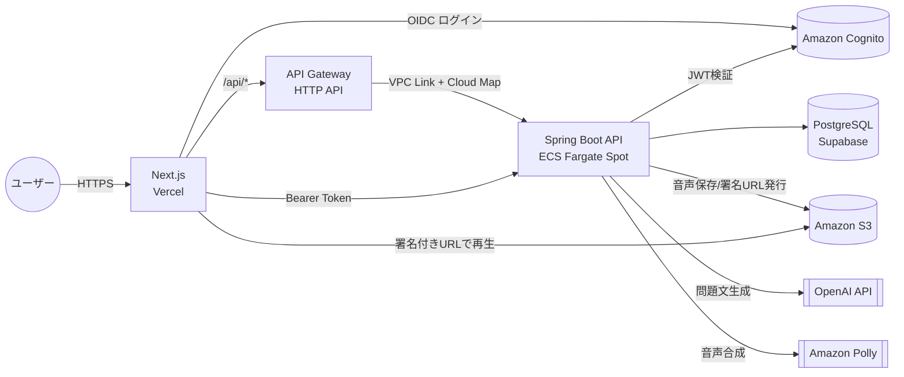
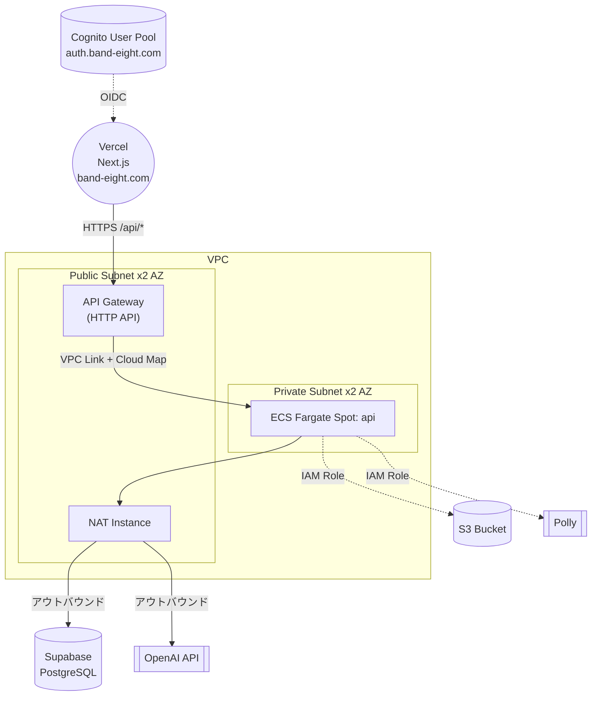

# システム要件定義書

- 文書種別: システム要件定義書（System Requirements Definition Document）
- 対象プロジェクト: IELTS Creator（IELTS練習問題作成アプリ／ポートフォリオ用途）
- 作成日: 2026-08-08
- 更新日: 2026-08-14（8章のバックエンド構成をALB/NAT Gatewayから実際の構成であるAPI Gateway+VPC Link+Cloud Map/NAT Instanceに修正し、本番稼働〔band-eight.com〕を反映）
- バージョン: 1.6
- 関連文書: [業務要件定義書](./業務要件定義書.md) / [画面遷移図](./画面遷移図.md) / [ロードマップ](./ロードマップ.md) / [画面設計書（frontend）](https://github.com/h-fujiwara-dev/ielts-creater-frontend/blob/main/docs/画面一覧.md) / [API仕様（backend）](https://github.com/h-fujiwara-dev/ielts-creater-backend/blob/main/docs/API一覧.md)

---

## 1. 文書の目的

本書は、[業務要件定義書](./業務要件定義書.md)で定義した業務要求を実現するために、システムが備えるべき**機能要件・画面要件・データ要件・外部インターフェース要件・非機能要件**を定義するものである。これらの要件を「どう実現するか」は8章の**アーキテクチャ**、および各リポジトリのドキュメント（frontend: 画面設計書 / backend: API設計書・ER図 / infra: Terraform構成）に記載する。

---

## 2. システム化の範囲

[業務要件定義書 2.3](./業務要件定義書.md#23-対象範囲スコープ) のスコープに基づき、以下の業務をシステム化する。

- ユーザー認証（サインアップ／ログイン／ログアウト）
- IELTS Reading / Listening 問題のAIによる自動生成
- 生成問題への回答受付・自動保存
- 自動採点・結果/解説表示
- 受験履歴の保存・一覧表示
- 学習ダッシュボード（スコア推移・正答率の可視化）

---

## 3. 機能要件

### 3.1 機能一覧

| No | 機能名 | 概要 | 優先度 |
| --- | --- | --- | --- |
| F-01 | ユーザー認証 | サインアップ／ログイン／ログアウト | 必須 |
| F-02 | 問題生成条件指定 | セクション・トピック・難易度の指定 | 必須 |
| F-03 | Reading問題自動生成 | パッセージ本文＋4形式の設問をAIが生成 | 必須 |
| F-04 | Listening問題自動生成 | 台本生成＋音声合成＋設問生成 | 必須 |
| F-05 | 生成状況の表示 | 生成中／完了／失敗のステータス表示とポーリング | 必須 |
| F-06 | 音声再生 | Listening音声の再生（連続再生対応） | 必須 |
| F-07 | 回答入力・自動保存 | 設問形式ごとの回答UIと自動保存 | 必須 |
| F-08 | 自動採点 | 提出時に正誤判定・スコア算出 | 必須 |
| F-09 | 結果・解説表示 | 設問ごとの正誤・正解・解説の提示 | 必須 |
| F-10 | 受験履歴一覧 | 過去の受験を日時・セクション別に一覧表示 | 必須 |
| F-11 | 学習ダッシュボード | スコア推移グラフ、セクション別正答率等の可視化 | 必須 |
| F-12 | 再生成 | 生成失敗時や気に入らない場合の再生成 | 推奨 |

### 3.2 各機能の詳細

#### F-01 ユーザー認証

- サインアップ時にメールアドレス・パスワードを入力し、確認コードによる検証を行う
- ログインしていないユーザーは演習・履歴・ダッシュボード機能を利用できない
- セッションの有効期限が切れた場合は再ログインを促す
- ポートフォリオ閲覧者向けに、アカウント登録なしで主要機能を試せる「ゲスト」機能を提供する（#00056）。固定の共有デモアカウントへ自動ログインする方式で、問題生成のみIPアドレス単位でクォータ制限し、生成データは一定時間後にバッチ削除する

#### F-02 問題生成条件指定

- セクション: Reading / Listening のいずれかを選択（必須）
- トピック: 自由入力またはプリセット（例: Environment, Technology, Education, Health）から選択
- 難易度: バンドスコア帯（例: Band 4-5 / Band 5-6 / Band 6-7 / Band 7-8+）から選択

#### F-03 Reading問題自動生成

- 1つの問題セットにつき、1つのパッセージ（英文本文）と、以下のいずれか複数の設問グループを生成する
  - True/False/Not Given（複数問）
  - Multiple Choice（単一・複数正解に対応）
  - Sentence/Fill in the Blank Completion（語数制限あり）
  - Matching Headings（段落と見出しの対応付け、ダミー選択肢を含む）
- 各設問には正解と解説が付随する（解説は結果画面でのみ開示）
- 生成された問題は本文中に根拠を持つこと（本文と無関係な設問を生成しないこと）を要件とする

#### F-04 Listening問題自動生成

- 会話またはモノローグ形式の台本をAIが生成し、話者ごとに異なる音声で読み上げる
- 台本の内容に基づき、Multiple ChoiceやForm/Note Completion形式の設問を生成する
- 生成された音声はユーザーが聞き取れる品質・速度であること
- 設問の答えは音声中で明確に言及されていること

#### F-05 生成状況の表示

- 生成には数秒〜数十秒を要するため、生成中であることをユーザーに明示する（ローディング表示）
- 生成失敗時は理由をユーザーにわかる形で表示し、再試行を案内する

#### F-06 音声再生

- Listening問題の音声を再生・一時停止できる
- 会話が複数の音声断片に分かれる場合も、ユーザーからは1つの連続した音声として聞こえること
- 再生位置の把握（進捗バー等）ができること

#### F-07 回答入力・自動保存

- 出題形式ごとに適切な入力UI（ラジオボタン、テキスト入力、ドラッグ&ドロップまたはプルダウンでのマッチング等）を提供する
- 回答内容はユーザーの操作に応じて自動的に保存され、ページ再読み込み後も復元される
- 全設問に回答していなくても提出は可能とする（未回答は不正解として扱う）

#### F-08 自動採点

- 提出操作をトリガーに、設問ごとの正誤判定とスコア（正答数／総設問数）を算出する
- 出題形式ごとに採点基準が異なることを考慮する（詳細は[backendリポジトリ docs/API設計書](https://github.com/h-fujiwara-dev/ielts-creater-backend/blob/main/docs/API設計書/)の提出系エンドポイントを参照）
- 部分点は付与しない（IELTS本試験の採点方式に準拠）
- 穴埋め系の設問では、綴りの表記ゆれ・大文字小文字・単数複数などの軽微な差異は許容する

#### F-09 結果・解説表示

- 設問ごとに「ユーザーの回答」「正解」「正誤」「解説」を表示する
- セクション全体のスコアサマリー（正答数／総設問数、正答率）を表示する

#### F-10 受験履歴一覧

- ユーザー自身の過去の受験を新しい順に一覧表示する
- 一覧からは各受験の詳細結果画面へ遷移できる（採点結果・解説の再確認）
- 一覧からは、過去に生成された問題セットをそのまま再受験する（回答画面へ遷移する）こともできる
- セクションによる絞り込みができる

#### F-11 学習ダッシュボード

- 受験回数、セクション別平均正答率を表示する
- 日次・週次等の時系列でのスコア推移をグラフ表示する
- 出題形式別（TFNG／MCQ／穴埋め等）の正答率を表示し、弱点形式を把握できるようにする

#### F-12 再生成

- 生成に失敗した場合、同条件での再生成を1クリックで行える
- 生成済みの問題セットに対する再生成（差し替え）は行わず、新しい問題セットとして生成する

---

## 4. 画面要件

### 4.1 画面一覧

| No | 画面名 | 概要 | ログイン要否 |
| --- | --- | --- | --- |
| S-01 | Top画面 | サービス概要を紹介し、ログイン／サインアップ画面（またはゲスト利用）へ誘導する | 不要 |
| S-02 | ログイン／サインアップ画面 | 認証操作を行う | 不要 |
| S-03 | 問題生成画面 | セクション・トピック・難易度を指定して生成を開始する | 必要 |
| S-04 | 回答画面 | 生成された問題（本文/音声＋設問）に回答する | 必要 |
| S-05 | 結果画面 | 採点結果・正誤・解説を表示する | 必要 |
| S-06 | 履歴一覧画面 | 過去の受験を一覧表示する | 必要 |
| S-07 | ダッシュボード画面 | スコア推移・正答率の傾向を表示する | 必要 |
| S-08 | プライバシーポリシー画面 | 個人情報の取扱い方針を提示する | 不要 |
| S-09 | 利用規約画面 | サービス利用にあたっての規約を提示する | 不要 |

S-01の「ゲストとして始める」導線（#00056）は、S-02のサインアップ・ログイン入力を経由せず共有デモアカウントで自動ログインしS-07へ直接遷移する。S-03〜S-07の「ログイン要否: 必要」はゲストのセッションでも満たされるため、画面要件自体に変更はない。

画面遷移図は[画面遷移図.md](./画面遷移図.md)、画面ごとの詳細レイアウトは[frontendリポジトリ docs/画面設計書/](https://github.com/h-fujiwara-dev/ielts-creater-frontend/blob/main/docs/画面設計書/)を参照。

---

## 5. データ要件

システムが保持すべき主要なデータ項目（エンティティ）は以下の通り。テーブル定義（カラム・型・制約）は[backendリポジトリ docs/ER図・テーブル定義.md](https://github.com/h-fujiwara-dev/ielts-creater-backend/blob/main/docs/ER図・テーブル定義.md)を参照。

| エンティティ | 保持する主な情報 |
| --- | --- |
| ユーザー | 認証基盤と紐づくID、メールアドレス、表示名 |
| 問題セット | セクション、トピック、難易度、生成ステータス、生成日時 |
| パッセージ（Reading本文） | 本文テキスト、段落構造 |
| 台本（Listening） | 話者情報、発話内容 |
| 音声セグメント | 台本の各発話に対応する音声ファイルの所在情報 |
| 設問グループ | 出題形式、設問への指示文 |
| 設問 | 設問文、正解、解説、（選択肢がある場合は）選択肢一覧 |
| 受験（Attempt） | 開始・提出日時、ステータス、獲得スコア |
| 受験回答 | 設問ごとのユーザー回答、正誤、採点時点の正解スナップショット |

**要件上のポイント**:

- 問題や正解が将来更新・削除されても、過去の受験履歴・採点結果は変化しないこと（監査性・一貫性の担保）
- 生成された問題文・音声・採点データはユーザー本人のみ閲覧可能であること

---

## 6. 外部インターフェース要件

| 連携先 | 用途 | 要件 |
| --- | --- | --- |
| 生成AI（LLM API） | Reading本文・設問生成、Listening台本・設問生成 | 構造化された出力（JSON形式）を安定して取得できること。JSONスキーマ検証に加え内容面のルールベース検証（本文根拠の整合性・語数制限超過等）を行い、失敗時は1回自動リトライすること |
| 音声合成API | Listening音声合成 | 話者ごとに異なる音声（Voice）で自然な読み上げができること |
| 認証基盤 | ユーザー認証 | サインアップ・ログイン・トークンによるAPI認可ができること |
| オブジェクトストレージ | 音声ファイルの保管 | 生成した音声をユーザーがストリーミング再生できる形で保管・配信できること。第三者から直接アクセスできないこと |

連携先の具体的な採用サービス（OpenAI API / Amazon Polly / Amazon Cognito / Amazon S3）は[8章 アーキテクチャ](#8-アーキテクチャ)、連携方式の詳細は[backendリポジトリ docs/API設計書](https://github.com/h-fujiwara-dev/ielts-creater-backend/blob/main/docs/API設計書/)で定義する。

---

## 7. 非機能要件

### 7.1 性能要件

- Reading問題の生成は概ね数秒〜15秒程度で完了すること
- Listening問題の生成（台本生成＋音声合成）は概ね30秒以内に完了すること
- 上記を超える場合はユーザーに待機中であることが伝わるUI（ローディング表示）を提供すること
- 採点処理（提出〜結果表示）は数秒以内に完了すること

### 7.2 可用性要件

- ポートフォリオ用途のため24時間365日の高可用性までは求めないが、デモ閲覧時に安定して動作すること
- 外部AI APIの一時的な障害時は、エラーメッセージを表示し再試行できること

### 7.3 セキュリティ要件

- 通信はすべてHTTPSで暗号化すること
- ユーザーのパスワードは自前で保持せず、認証基盤に委譲すること
- 各ユーザーは自分自身が生成した問題・履歴のみ閲覧・操作できること（他ユーザーのデータへアクセスできないこと）
- 音声ファイル等の保管先は非公開設定とし、期限付きの署名付きURLでのみ配信すること
- APIキー等の機密情報はソースコードやクライアント側に含めず、サーバー側のシークレット管理機構で保持すること

### 7.4 運用・保守性要件

- インフラ構成はコードで管理し（IaC）、環境の再現性を担保すること
- ビルド・デプロイはCI/CDにより自動化すること
- 障害調査のためのログを収集できること

### 7.5 コスト要件

- 個人ポートフォリオ用途のため、クラウド利用コストを抑えられる構成とすること（デモ利用しない期間はインフラを停止・削除できること）
- 外部AI APIの呼び出し回数・コストが想定外に増大しないよう、ユーザーごとに1日2回までの生成回数上限を設けること。上限到達時はエラーメッセージを表示する（代替導線は設けない）
- 生成に使用するAIモデルは軽量モデル（`gpt-4o-mini`相当）に統一し、単価を抑えること。同一条件（トピック・難易度）でもキャッシュはせず、都度生成する

### 7.6 拡張性要件

- 将来的にWriting/Speakingセクションや新しい出題形式（例: Map Labeling）を追加しやすい設計とすること
- 出題形式の追加が、既存の採点ロジックに影響を与えにくい構造とすること

---

## 8. アーキテクチャ

7章までの要件を実現するための技術構成。

### 8.1 採用技術一覧

| レイヤ | 採用技術 | 補足 |
| --- | --- | --- |
| フロントエンド | Next.js（App Router）+ TypeScript | **Vercel**でホスティング（Git連携による自動デプロイ） |
| バックエンド | Spring Boot + Java 21 | Virtual Threadsを有効化し、外部API呼び出し中心のI/Oバウンドな処理に対応。Amazon ECS Fargate Spotで稼働 |
| データベース | PostgreSQL（**Supabase**） | JSONB型でAI生成コンテンツのメタデータを保持。SSL必須（`sslmode=require`）で接続 |
| 認証基盤 | Amazon Cognito（User Pool） | フロントはNextAuth.jsのCognitoプロバイダ、バックエンドはSpring Security Resource Serverで連携。本番はHosted UIをカスタムドメイン`auth.band-eight.com`で公開 |
| APIエントリポイント | Amazon API Gateway（HTTP API）+ VPC Link + Cloud Map | コスト最適化のためALBではなくこの構成を採用し、ECS Service Discovery経由でECSタスクへ直接ルーティングする（[#00044](https://github.com/h-fujiwara-dev/ielts-creater/blob/main/tickets/00044_backendのAWSインフラ構築とSupabase接続.md)） |
| ファイルストレージ | Amazon S3 | Listening音声ファイルを保管し、署名付きURLで配信 |
| コンピュート | Amazon ECS Fargate Spot | バックエンドAPIのみをコンテナ稼働（フロントエンドはVercel）。コスト最適化のためSpotを採用 |
| 生成AI（LLM） | OpenAI API（`gpt-4o-mini`） | Structured Outputsで問題文・設問をJSON構造化して生成 |
| 音声合成 | Amazon Polly | Neural Engineで話者ごとに異なる音声を合成 |
| インフラ構成管理 | Terraform | AWS側リソース（ECS/API Gateway/NAT Instance/S3/Cognito等）をコード化（[infraリポジトリ](https://github.com/h-fujiwara-dev/ielts-creater-infra)）。dev/prod2環境を構築。Vercel/Supabaseは各サービスのダッシュボードで管理 |
| CI/CD | GitHub Actions + Vercel自動デプロイ | backend/infraはGitHub Actions、frontendはVercelのGit連携によるプレビュー/本番デプロイ |

### 8.2 全体アーキテクチャ図

### 8.3 AWSインフラ構成図

- コスト最適化のため、ALB/NAT GatewayではなくAPI Gateway（HTTP API）+ VPC Link + Cloud Map（ECS Service Discovery）とNAT Instance（EC2）を採用している（[#00044](https://github.com/h-fujiwara-dev/ielts-creater/blob/main/tickets/00044_backendのAWSインフラ構築とSupabase接続.md)）
- Public Subnetに配置するのはAPI Gateway用VPC LinkとNAT Instanceのみ。ECSタスクはPrivate Subnetに配置し、インターネットから直接到達できないようにする
- フロントエンドはVPC外のVercelでホスティングし、API Gateway（HTTP API）+ VPC Link + Cloud Map経由でバックエンドAPIを呼び出す
- データベースはVPC外のSupabase（マネージドPostgreSQL）を採用し、ECSタスクからNAT Instance経由のアウトバウンド接続で利用する（RDSは使用しない）
- ECSタスクはNAT Instance経由でSupabase・OpenAI API等の外部サービスへアウトバウンド通信する
- dev/prod2つの環境を構築済みで、本番は独自ドメイン`band-eight.com`（Cloudflare DNS）で公開し、Cognito Hosted UIは`auth.band-eight.com`のカスタムドメインを使用する（[#00050](https://github.com/h-fujiwara-dev/ielts-creater/blob/main/tickets/00050_本番環境のAWSインフラ構築とCICDパイプライン整備.md) / [#00051](https://github.com/h-fujiwara-dev/ielts-creater/blob/main/tickets/00051_frontendとbackendの本番環境への初回デプロイ.md)）
- Terraformコード本体は[infraリポジトリ](https://github.com/h-fujiwara-dev/ielts-creater-infra)で管理する（対象はECS/API Gateway/NAT Instance/S3/Cognito等のAWS側リソースのみ）

### 8.4 非機能要件の実現方式

| 非機能要件（[7章](#7-非機能要件)） | 実現方式 |
| --- | --- |
| 性能要件 | 生成処理を非同期化しUXを損なわない設計とする。DBには`attempt`テーブルへのインデックス(`user_id, submitted_at`)を設ける |
| 可用性要件 | フロントエンドはVercelのグローバルCDN配信、バックエンドはECS Fargate SpotのマルチAZ配置と`/actuator/health`ヘルスチェック |
| セキュリティ要件 | API GatewayでHTTPS終端、Cognitoによる認証委譲、S3非公開+署名付きURL、Supabase接続はSSL必須、Secrets ManagerでAPIキー・DB接続文字列を管理、IAM最小権限 |
| 運用・保守性要件 | TerraformによるIaC（AWS側）、GitHub ActionsとVercel自動デプロイによるCI/CD、CloudWatch Logs/Alarmsによる監視 |
| コスト要件 | フロントエンド（Vercel）・データベース（Supabase）は無料/低価格プランを活用し常時起動コストを抑制。AWS側もdev環境はNAT1台等の小規模構成とし、利用しない期間は`terraform destroy`可能な構成とする |
| 拡張性要件 | 採点ロジックをStrategyパターンで分離し、出題形式追加時の影響範囲を限定する（詳細は[backendリポジトリ docs/API設計書](https://github.com/h-fujiwara-dev/ielts-creater-backend/blob/main/docs/API設計書/)の提出系エンドポイント） |

---

## 9. 未決事項・今後の検討課題（システム観点）

現時点で未決事項はない。旧Q-1〜Q-3（プロンプト設計基準／生成回数制限／生成品質の検知）は[#00025](https://github.com/h-fujiwara-dev/ielts-creater/blob/main/tickets/00025_AI連携方針のブラッシュアップ.md)でAI連携方針として確定済み。詳細は[6章 外部インターフェース要件](#6-外部インターフェース要件)・[7.5 コスト要件](#75-コスト要件)・[8.1 採用技術一覧](#81-採用技術一覧)を参照。

フロントエンドのホスティング先（Vercel）・データベースのマネージドサービス（Supabase）の採用は[#00037](https://github.com/h-fujiwara-dev/ielts-creater/blob/main/tickets/00037_インフラ構成の見直し（Vercel_Supabase化）とREADME構成図の追加.md)で確定済み。バックエンド（ECS Fargate）・認証（Cognito）・音声ストレージ（S3）は変更なし。
