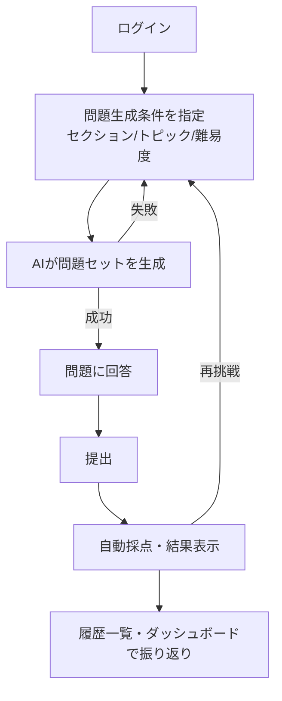

# 業務要件定義書

- 文書種別: 業務要件定義書（Business Requirements Definition Document）
- 対象プロジェクト: IELTS Creator（IELTS練習問題作成アプリ／ポートフォリオ用途）
- 作成日: 2026-08-08
- バージョン: 1.0
- 関連文書: [システム要件定義書](./システム要件定義書.md) / [画面遷移図](./画面遷移図.md) / [ロードマップ](./ロードマップ.md) / [画面設計書（frontend）](https://github.com/h-fujiwara-dev/ielts-creater-frontend/blob/main/docs/画面一覧.md) / [API仕様（backend）](https://github.com/h-fujiwara-dev/ielts-creater-backend/blob/main/docs/API一覧.md)

---

## 1. 文書の目的

本書は、「IELTS Creator」における**業務上の背景・目的・利用者・業務フロー**を定義するものである。システムがどのような技術で実現されるかではなく、「誰が」「何のために」「どのように」本サービスを利用するかという業務観点の要求を明確化することを目的とする。

技術的な機能要件・非機能要件・アーキテクチャは「[システム要件定義書](./システム要件定義書.md)」に、各リポジトリの実装詳細（frontend: 画面設計書 / backend: API設計書・ER図 / infra: Terraform構成）はそれぞれのリポジトリのドキュメントに記載する。

---

## 2. システム概要

### 2.1 背景

IELTS（International English Language Testing System）の受験対策には大量の演習問題が必要だが、市販の問題集は数が限られており、同じ問題を繰り返し解くことになりがちである。また、既存の学習サービスの多くは固定コンテンツの提供にとどまり、受験者のレベルや興味に応じた問題を都度生成する仕組みは一般的ではない。

一方で、LLM（大規模言語モデル）の発展により、指定した条件（トピック・難易度・出題形式）に沿った高品質な問題文・設問・解説を動的に生成することが実用的になっている。この技術動向を活かし、「解いた分だけ新しい問題が手に入る」演習環境を構築する。

### 2.2 目的

- IELTS Reading / Listening の練習問題を、ユーザーが指定したトピック・難易度に応じてAIが都度自動生成する
- 生成した問題にその場で回答し、自動採点・解説の提示・履歴への記録までを一気通貫で行う
- 受験者が自身の学習履歴・スコア推移を振り返られるダッシュボードを提供する
- **開発者（本人）にとっては**、LLMを用いたコンテンツ生成、AWS基盤のIaCによる構築・運用、フルスタックWebアプリケーション設計の実務力を示すポートフォリオとする

### 2.3 対象範囲（スコープ）

#### スコープ内

| 区分 | 内容 |
| --- | --- |
| 対象セクション | IELTS Reading、IELTS Listening |
| 出題形式（Reading） | True/False/Not Given、Multiple Choice（単一・複数選択）、Sentence/Fill in the Blank Completion、Matching Headings |
| 出題形式（Listening） | Multiple Choice、Form/Note Completion（穴埋め系） |
| 利用者管理 | アカウント登録・ログイン |
| 採点 | 客観問題の自動採点（正誤判定・スコア算出） |
| 学習履歴 | 受験履歴の保存、スコア推移の可視化 |

#### スコープ外（本フェーズでは対象としない）

| 区分 | 内容 | 除外理由 |
| --- | --- | --- |
| Writing | IELTS Writing Task 1/2 | 自由記述の採点にはLLMによる高度な評価ロジックが必要で、MVPの範囲を超えるため次期検討 |
| Speaking | IELTS Speaking | 音声入出力・対話評価が必要でハードルが高いため次期検討 |
| 教師/管理者向け機能 | 問題の手動編集・他ユーザーの管理 | 個人学習用途に特化するため対象外 |
| 講師によるフィードバック（人手） | 人間講師によるレビュー・添削 | 自動生成・自動採点で完結する設計のため対象外 |
| 多言語対応（UI） | 日本語以外のUI | MVPでは日本語UIのみを対象 |

---

## 3. 用語定義

| 用語 | 説明 |
| --- | --- |
| 問題セット (Question Set) | 1回の生成リクエストによって作られる、パッセージ／台本＋複数の設問グループからなる一式 |
| セクション | Reading または Listening の区分 |
| 設問グループ (Question Group) | True/False/Not Given、Multiple Choice等、出題形式ごとにまとまった設問の集合 |
| 受験 (Attempt) | ユーザーが1つの問題セットに対して回答を開始してから提出するまでの1セッション |
| バンドスコア (Band Score) | IELTSの評価尺度（本アプリでは難易度指定の目安として使用し、公式採点との厳密な一致は保証しない） |
| TFNG | True / False / Not Given 形式の略称 |
| 自動採点 | 正解データとの照合により、人手を介さずに正誤・得点を算出する処理 |

---

## 4. 利用者・ステークホルダー

| 区分 | 内容 |
| --- | --- |
| 主利用者（エンドユーザー） | IELTS受験を控えた学習者。自分でトピック・難易度を選び、演習を繰り返して弱点を把握したい個人 |
| 副次的な想定読者 | 本アプリの開発者を評価する採用担当者・エンジニア（ポートフォリオとしての閲覧者） |
| システム管理者 | 開発者自身が兼務。ユーザーサポートやコンテンツの手動編集機能は設けない |

---

## 5. 業務要件（主要ユースケース）

### UC-1. 新規問題セットの生成

1. ユーザーはログイン後、セクション（Reading/Listening）・トピック・難易度を選択する
2. システムはAIに問題生成を依頼し、生成中であることを画面に表示する
3. 生成が完了すると、ユーザーは回答画面に遷移できる
4. 生成に失敗した場合、エラー内容を表示し再生成を促す

### UC-2. 問題への回答と提出

1. ユーザーは生成された問題セット（Reading本文＋設問、またはListening音声＋設問）に回答する
2. 回答は都度自動保存され、ページ離脱・再訪問時も回答内容が保持される
3. ユーザーが提出操作を行うと、システムは自動採点を実行し、結果画面へ遷移する

### UC-3. 結果確認

1. ユーザーは正答数・スコア・設問ごとの正誤と解説を確認する
2. 誤答した設問については、正解と解説を確認できる

### UC-4. 学習履歴・進捗確認

1. ユーザーは過去の受験履歴一覧（日時・セクション・スコア）を閲覧できる
2. ユーザーはダッシュボードでスコア推移・セクション別正答率などの傾向を確認できる

### UC-5. 認証

1. ユーザーはアカウント登録・ログイン・ログアウトを行う
2. 未ログイン状態で保護されたページにアクセスした場合、ログイン画面へ誘導される

### 5.1 業務フロー図

---

## 6. 制約条件・前提条件

- 個人開発（開発者1名）による構築であり、開発・運用リソースは限定的である
- 対象言語（アプリUI）は日本語のみとし、生成される英語問題文はIELTS本試験相当の英語とする
- AI生成コンテンツの内容は完全な正確性を保証するものではなく、実際のIELTS試験内容・採点基準と完全に一致しない場合がある旨をアプリ内に明示する
- 本アプリの学習成果・スコアは公式IELTSスコアを保証・代替するものではない

---

## 7. マイルストーン（開発フェーズ）

| フェーズ | ゴール |
| --- | --- |
| Phase 1 | 認証・AWSインフラなしで、ローカル環境にて「生成→回答→採点」のコア体験を完成させる |
| Phase 2 | ユーザー認証と、受験履歴・ダッシュボードのデータ永続化を実装する |
| Phase 3 | AWSインフラをTerraformで構築し、CI/CDで本番環境へデプロイする |
| Phase 4 | ダッシュボードの充実、UI/UXの磨き込み、監視・ドキュメント整備を行う |

各フェーズの技術的な実装タスクの詳細は[開発フェーズとの対応](./ロードマップ.md)を参照。

---

## 8. 未決事項・今後の検討課題（業務観点）

| No | 内容 | 備考 |
| --- | --- | --- |
| Q-1 | Writing/Speakingセクションを将来追加するか | 本要件定義書のスコープ外。次期検討事項として記録 |
| Q-2 | 難易度（バンドスコア帯）の区分をどこまで細かくするか | ユーザーテストを行いながら調整する |
| Q-3 | 学習継続を促す仕組み（通知・目標設定等）を設けるか | MVPでは対象外、利用状況を見て検討 |
