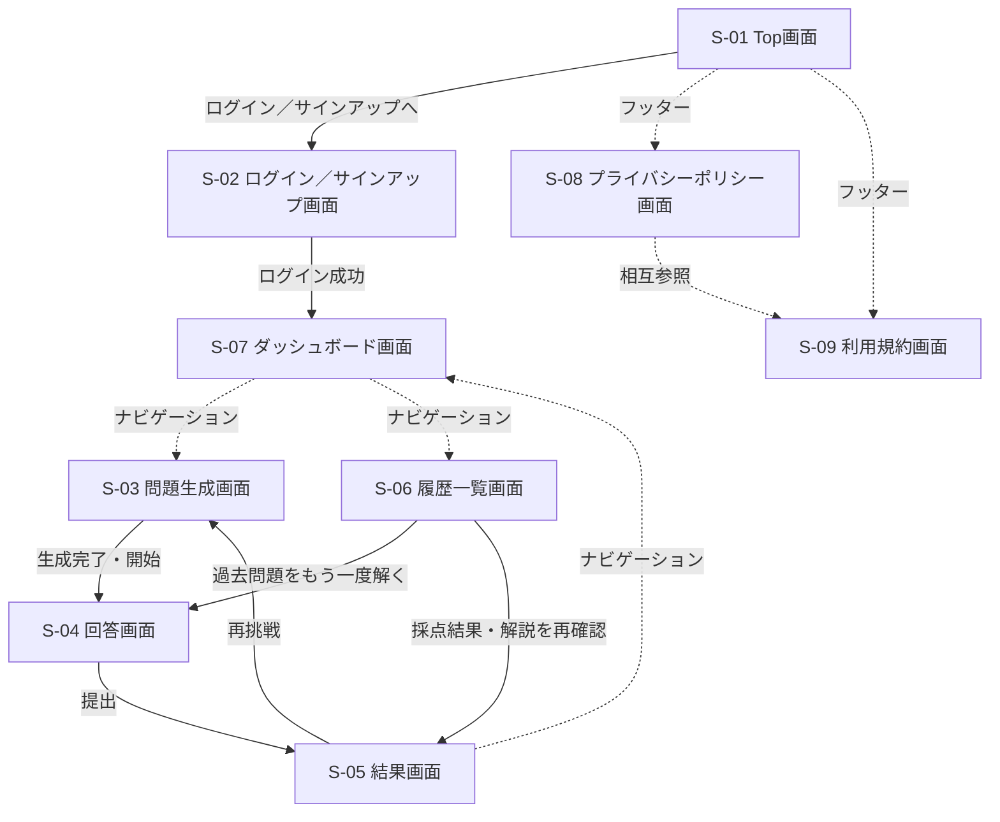

# 画面遷移図

- 更新日: 2026-08-09（ログイン後の遷移先をダッシュボードに変更し、ダッシュボードを起点とするフローに再編）
- バージョン: 1.2
- 関連文書: [システム要件定義書 4章 画面要件](./システム要件定義書.md#4-画面要件) / [frontendリポジトリ docs/画面設計書/（画面ごとの詳細）](https://github.com/h-fujiwara-dev/ielts-creater-frontend/blob/main/docs/画面設計書/)

- ダッシュボード（S-07）を認証後の起点（ハブ）とし、問題生成（S-03）・履歴一覧（S-06）へはダッシュボード経由でアクセスする
- 履歴一覧（S-06）からは、過去問題の再受験（回答画面へ）と、採点結果・解説の再確認（結果画面へ）の2パターンで遷移できる

各画面の詳細（主要要素・主な操作）は[frontendリポジトリ docs/画面設計書/](https://github.com/h-fujiwara-dev/ielts-creater-frontend/blob/main/docs/画面設計書/)を参照。

S-01 Top画面のビジュアルデザイン（スクリーンショット）は、デザイン検討の経緯を含めて[#00005](../tickets/00005_TOP画面のFigmaデザイン作成.md)、詳細仕様は[frontendリポジトリ docs/画面設計書/S-01_Top画面.md](https://github.com/h-fujiwara-dev/ielts-creater-frontend/blob/main/docs/画面設計書/S-01_Top画面.md)を参照。
