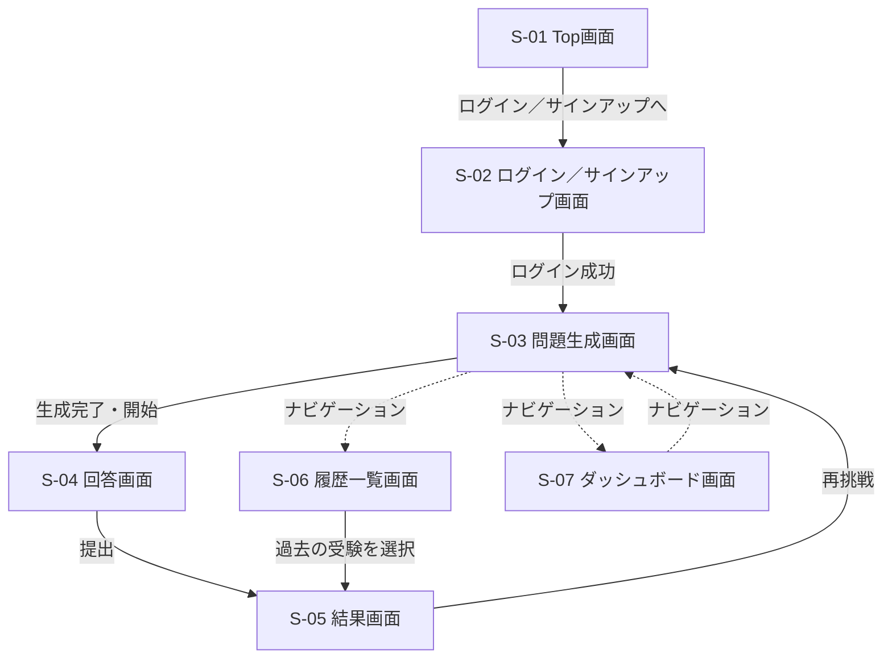

# 画面遷移図

- 更新日: 2026-08-09（スラッシュ表記を統一、バージョン欄を追加）
- バージョン: 1.0
- 関連文書: [システム要件定義書 4章 画面要件](./システム要件定義書.md#4-画面要件) / [frontendリポジトリ docs/画面設計書/（画面ごとの詳細）](https://github.com/h-fujiwara-dev/ielts-creater-frontend/blob/main/docs/画面設計書/)

各画面の詳細（主要要素・主な操作）は[frontendリポジトリ docs/画面設計書/](https://github.com/h-fujiwara-dev/ielts-creater-frontend/blob/main/docs/画面設計書/)を参照。
