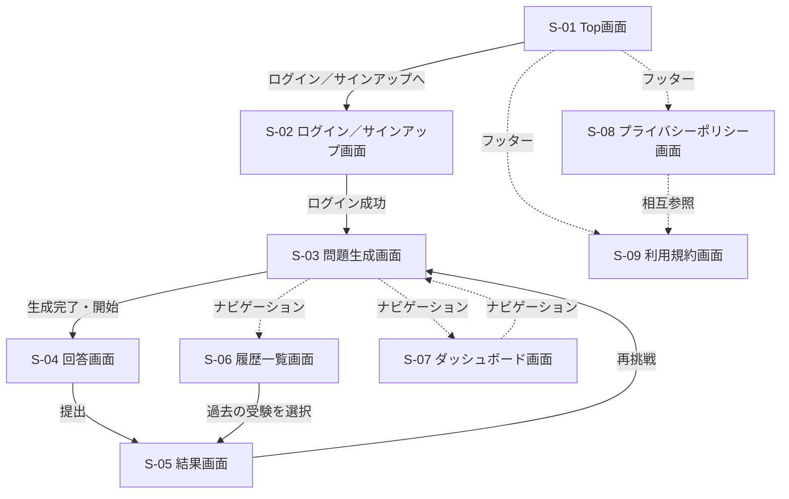

# 画面遷移図

- 更新日: 2026-08-09（S-01フッターからS-08/S-09への静的遷移を追加）
- バージョン: 1.1
- 関連文書: [システム要件定義書 4章 画面要件](./システム要件定義書.md#4-画面要件) / [frontendリポジトリ docs/画面設計書/（画面ごとの詳細）](https://github.com/h-fujiwara-dev/ielts-creater-frontend/blob/main/docs/画面設計書/)

各画面の詳細（主要要素・主な操作）は[frontendリポジトリ docs/画面設計書/](https://github.com/h-fujiwara-dev/ielts-creater-frontend/blob/main/docs/画面設計書/)を参照。

## 画面プレビュー

### S-01 Top画面

デザイン検討の経緯・全セクションのスクリーンショットは[#00005](../tickets/00005_TOP画面のFigmaデザイン作成.md)、詳細仕様は[frontendリポジトリ docs/画面設計書/S-01_Top画面.md](https://github.com/h-fujiwara-dev/ielts-creater-frontend/blob/main/docs/画面設計書/S-01_Top画面.md)を参照。
